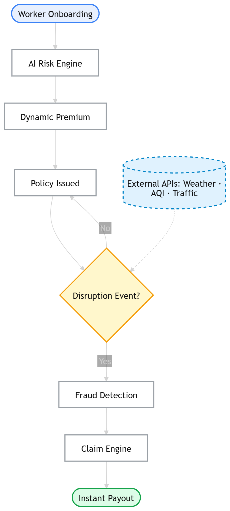
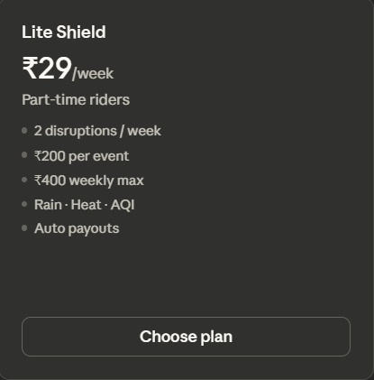
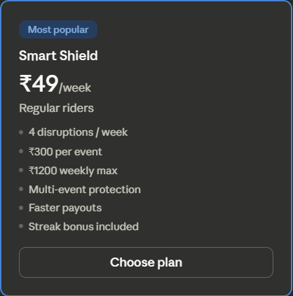
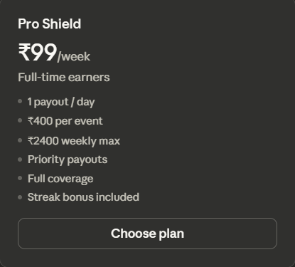
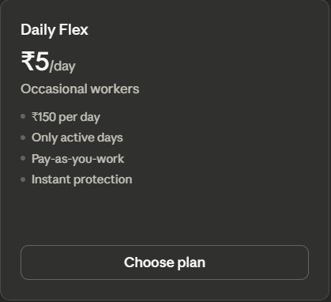
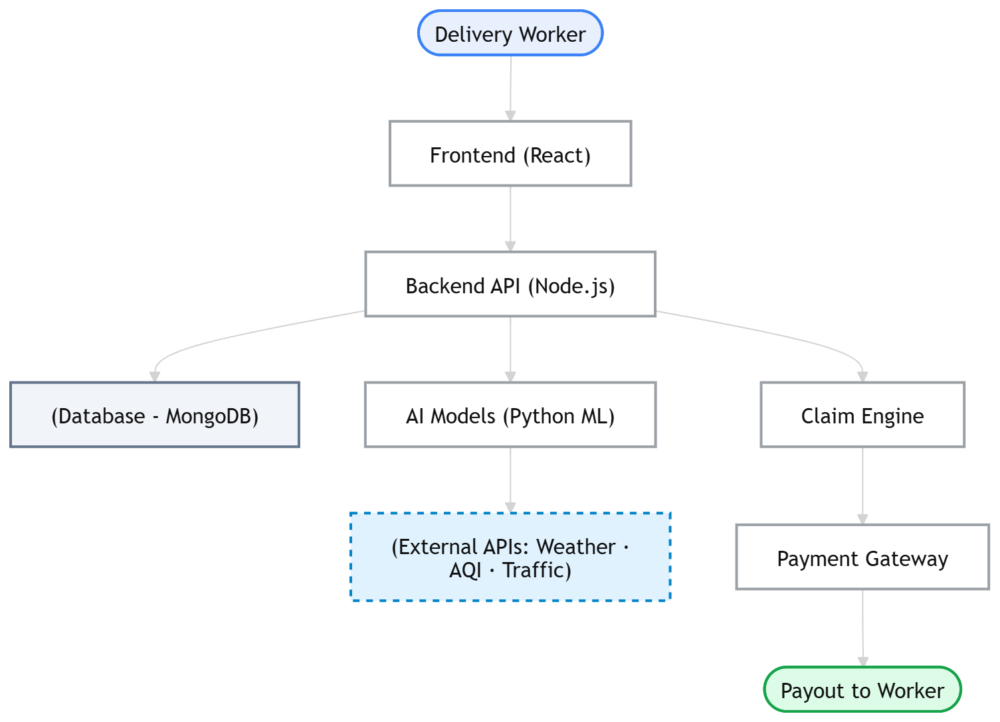

<div align="center">

# 🛡️InsurGo


### AI-Powered Parametric Insurance for Delivery Workers

**"When Work Stops, We Don't."**

<br/>

[](/)
[](/)
[](/)

<br/>


</div>

---

## 🌍 Overview

> **The Problem:** Millions of gig workers powering platforms like **Zepto, Blinkit, Swiggy**, and **Zomato** rely entirely on daily earnings with zero safety net.

When disruptions strike, they lose everything:

| Disruption | Impact |
|:----------:|--------|
|  **Heavy Rain** | Routes become dangerous, orders drop |
|  **High Pollution** | Health risks force workers indoors |
| **Curfews** | Operations halt completely |
|  **Flooding** | Streets become impassable |

📉 **Result:** Income loss of **20–30%** during disruptions with no compensation.

---

## 💡 Solution

**InsurGo** is a next-generation **AI-powered parametric insurance platform** designed specifically for delivery workers, protecting them from **income loss due to external disruptions**.

<div align="center">

|  Real-Time Detection |  AI Validation |  Instant Payouts |
|:----------------------:|:----------------:|:------------------:|
| Monitor disruptions 24/7 | Smart eligibility checks | Money in minutes |

</div>

<br/>

> ### ✨ No claims. No paperwork. No waiting.

---
## 👤 Target Persona

### The Quick Commerce Delivery Worker

<table>
<tr>
<td width="60%">

####  Meet Rahul

| Attribute | Details |
|-----------|---------|
| **Platform** | Zepto Delivery Partner |
| **Typical Earnings** | ₹800 – ₹1,200 per day |
| **The Pain Point** | During heavy rain, curfew, or severe waterlogging, delivery volumes drop or become dangerous to fulfill. He loses working hours and his daily income plummets. |

</td>
<td width="40%">

#### 🎯 The Solution

**InsurGo ensures Rahul receives automatic, instant compensation** during these exact disruptions keeping his income stable when he needs it most.

</td>
</tr>
</table>

---
## 🔄 How It Works? (Workflow)

InsurGo uses **parametric insurance** where payouts are triggered automatically by measurable environmental events, not manual claims.

<div align="center">



</div>

---

## 🎯 Parametric Triggers

The system constantly monitors environmental events. When predefined thresholds are crossed, compensation is triggered automatically.

| Event Type | Trigger Threshold | Data Source |
|:----------:|:-----------------:|:-----------:|
|  **Heavy Rain** | Rainfall > 60mm | OpenWeather API |
|  **Flooding** | Severe waterlogging / Road closures | Traffic/Weather APIs |
|  **Air Pollution** | AQI > 300 | AQI API |
|  **Lockdown/Curfew** | Major road blockages / Curfews | Traffic APIs (Mappls) |

---


## ⚡ Real-World Scenario Simulation


<table>
<tr>
<td width="33%" align="center">

###  Event Detected

| Metric | Value | Threshold |
|--------|:-----:|:---------:|
| Rainfall | **65mm** | 60mm |
| Order Drop | **60%** | 40% |

✅ **Disruption Confirmed**

</td>
<td width="33%" align="center">

###  Eligibility Check

| Criteria | Status |
|----------|:------:|
| Active rider (last 60 min) | ✅ |
| Policy active | ✅ |
| In affected zone | ✅ |

✅ **Verified**

</td>
<td width="33%" align="center">

###  Auto Payout(Depends on the chosen policy)

**₹120/hour × 3 hours**

<h2>₹360</h2>

💸 **Credited Instantly**

</td>
</tr>
</table>

---

## 📊 Platform Features

<div align="center">

| Feature | Description |
|:-------:|-------------|
|  **Seamless Worker Registration** | Quick onboarding with minimal friction |
|  **AI-Driven Risk Profiling** | Personalized risk assessment for each worker |
|  **Active Policies** | Starting from just ₹21/week |
|  **Automated Claim Triggers** | Zero-touch claim processing |
|  **Anomaly & Fraud Detection** | AI-powered protection against misuse |
|  **Instant Payouts** | Direct transfers via payment gateways |
|  **Comprehensive Analytics Dashboard** | Real-time insights and reporting |

</div>

---
## 💰 Weekly Insurance Model

> Gig workers earn on weekly cycles so our premiums match that rhythm.
<div align="center">

<table>
<tr>
<td></td>
<td></td>
</tr>
<tr>
<td></td>
<td></td>
</tr>
</table>

</div>

### 🧮 Model V.2 (Future Enhancement)

```
Premium = Risk Score × Coverage Factor
```

#### Example Calculation:

| Parameter | Value |
|-----------|:-----:|
| Worker Weekly Income | ₹5,000 |
| Coverage (per disruption) | ₹500 |
| AI Risk Score | 0.65 |
| **Weekly Premium** | **₹25** |

*Affordable, fair, and dynamically adjusted by AI based on your zone, weather history, and delivery patterns.*

---
## 🏗️ System Architecture 

<div align="center">



</div>

---

## 💻 AI Components

<table>
<tr>
<td width="33%" align="center">

### ⚡  Risk Engine *(Future)* 
Estimates zone-level risk to dynamically adjust weekly premiums  

</td>
<td width="33%" align="center">

### 📊 Payout Engine  
Predicts disruption probability and computes fair payouts using real-time environmental data 

</td>
<td width="33%" align="center">

### 🛡️ Fraud Detection
Detects GPS spoofing, duplicate claims, and anomalies using Isolation Forest

</td>
</tr>
</table>

---

## 🎯 Adversarial Defense & Anti-Spoofing Strategy

### The Threat: Market Crash Fraud Ring

A coordinated fraud ring runs **500+ fake delivery partners** with spoofed GPS data to drain the platform's liquidity pool through false claims. Our defense must distinguish between:
- ✅ **Genuine stranded workers** (legitimate income loss during real disruptions)
- ❌ **Fake GPS spoofing** (stationary workers claiming to be active)
- ❌ **Fraud rings** (coordinated, synchronized fake claims)

---

### Multi-Layer Detection Strategy
*We will be using a multilayer explained as follows:*

#### **Layer 1: GPS Movement Verification**

**Detection Logic:**
- Monitor **GPS trajectory consistency** over time windows (5min, 15min, 30min, 1hr)
- Flag impossibilities: speed > 120 km/h on city streets, teleportation jumps > 2km in 1 minute
- Genuine workers show natural movement patterns; fraudsters show static positions or geometric teleportation

**Key Signals:**
| Signal | Genuine Worker | Fraud Ring |
|:------:|:----------:|:--------:|
| Movement Speed | 5–25 km/h (realistic) | 0 km/h OR 200+ km/h (impossible) |
| GPS Jitter | Natural ±5–10m variance | Perfect circular stasis OR clean line patterns |
| Zone Transitions | Slow drift across zones | Instant zone changes (multi-device sync) |
| Active Hours | Matched with event duration | 24/7 stationary in same pixel |

**Implementation:**
- Calculate **velocity vectors** between consecutive GPS points (every 30 seconds)
- Flag if velocity > 150 km/h for delivery context
- Flag if position variance < 10m for >60 minutes during active order claim
- Compare actual route distance vs displacement distance (ratio should be 1.2–1.8x)

---

#### **Layer 2: Behavioral Pattern Clustering**

**Detection Logic:**
- Fraud rings exhibit **synchronized patterns**—hundreds of workers claiming simultaneously with identical claim amounts
- Use **Isolation Forest** to detect outliers in claim behavior

**Key Signals:**
| Metric | Genuine Workers | Fraud Ring |
|:------:|:----------:|:--------:|
| Claim Timing Variance | Spread across 2–4 hours | Clustered within 60 seconds (±5 sec) |
| Claim Amount Variance | ±15% variation | Identical to 4 decimal places |
| Event Correlation | Claims during actual disruption events | Claims when NO disruption detected |
| Inter-claim Interval | Random, organic timing | Perfect intervals (15-min repeats) |

**Implementation:**
- Group claims by eventId + timestamp (10-second buckets)
- If >50 claims in single 60-second window → Fraud Ring Alert
- Calculate coefficient of variation (std dev / mean) for claim amounts
  - Genuine: CV > 0.20 (natural variation)
  - Fraud: CV < 0.05 (suspiciously identical)
- Flag if same amount claimed repeatedly within 24 hours

---

#### **Layer 3: Environmental & Contextual Validation**

**Detection Logic:**
- Cross-reference GPS location with actual event data
- Fraudsters claim during calm weather; genuine workers claim during disruptions

**Key Signals:**
| Validation | Genuine Claim | Fraud Claim |
|:------:|:----------:|:--------:|
| Weather Match | GPS zone + claim time = high rainfall/AQI | GPS zone shows clear skies |
| Order Volume Drop | Linked to documented platform-wide order drop | Platform had normal volume |
| Payment Gateway | Real bank account with history | Fresh account, low KYC score |
| Platform Status | Active delivery orders during claim | Zero platform activity |

**Implementation:**
- Cross-check claimed location with:
  - Rainfall data from OpenWeather (within 500m radius)
  - AQI data (must match threshold trigger)
  - Traffic API reported congestion/blockages
- Flag if claim zone shows **OPPOSITE conditions** (high AQI while claiming rain, etc.)
- Require claim location within 50m of authenticated order pickup/delivery points

---

#### **Layer 4: Device & Network Intelligence**

**Detection Logic:**
- Fraud rings rotate through identical or cloned devices
- Network signatures reveal coordinated attack patterns

**Key Signals:**
| Signal | Genuine Worker | Fraud Ring |
|:------:|:----------:|:--------:|
| Device ID Turnover | Stable 1–2 devices per worker | 10+ device IDs claiming same identity |
| MAC Address | Real device | Spoofed/randomized patterns |
| IP Address Geolocation | Matches claimed GPS zone | IP from different city/country |
| Mobile Carrier | Consistent pattern | Rotating across 5+ carriers |
| App Version | Up-to-date or recent | Outdated versions (pattern of non-updates) |

**Implementation:**
- Hash device MAC + serial for anomaly scoring
- Flag if IP geolocation distance > 50km from claimed GPS location
- Track device-to-user mapping: if 1 device claims for 15+ unique users → Fraud Ring
- Flag sudden device rotation (user switching 5+ devices in 24 hours)

---

#### **Layer 5: KYC & Identity Verification**

**Detection Logic:**
- Fake accounts have weak identity markers
- Genuine workers have strong platform verification history

**Key Signals:**
| Check | Genuine Worker | Fraud Account |
|:------:|:----------:|:--------:|
| KYC Verification | Government ID + selfie verified | Minimal KYC, poor quality docs |
| Platform Integration | Verified with Zepto/Swiggy/Zomato | No platform verification |
| Account Age | >30 days with activity history | <7 days old (fresh signup) |
| Bank Account Status | Active, matched name/ID | Dummy/generic accounts |
| Phone Number | Registered to single carrier | VOIP/temporary numbers |

**Implementation:**
- Calculate **KYC strength score** (0–100):
  - Government ID present: +30 pts
  - Platform verification: +40 pts
  - Account age >30 days: +20 pts
  - Bank account KYC matched: +10 pts
- Block claims if KYC score < 50
- Require re-verification if same bank account linked to >20 new users

---

#### **Layer 6: Temporal & Sequential Patterns**

**Detection Logic:**
- Fraud rings claim in mechanical patterns; genuine workers have organic timing

**Key Signals:**
| Pattern | Genuine | Fraud Ring |
|:------:|:----------:|:--------:|
| Claim Recurrence | Random, disruption-dependent | Every 15/30/60 min precisely |
| Daily Claim Cycles | Aligned with work hours (6 AM–11 PM) | 24/7 uniform distribution |
| Gap Analysis | Natural work breaks | Zero gaps (inhuman endurance) |
| Previous Denials | Low rejection rate <5% | Repeatedly denied, then succeeds with clones |

**Implementation:**
- Calculate **claim entropy** for each user:
  - High entropy = genuine (random timing)
  - Low entropy = suspicious (mechanical pattern)
- Use **Benford's Law** on claim amounts (first digit distribution):
  - Genuine: follows natural log distribution
  - Fraud: uniform or suspicious clustering
- Flag if user claims every hour for 8+ consecutive hours

---

### 🛡️ Punishment & Reward Logic

#### ✅ Protecting Honest Workers

**Whitelist Mechanisms:**
- Grace period (first 10 claims = higher tolerance)  
- Reputation boost (50+ verified = less scrutiny)  
- Appeal system (extra proof within 48 hrs)  
- Gradual verification (partial → full coverage)

**Honest Profile:**
- Natural GPS (5–25 km/h)  
- Claims spread, varied amounts  
- Matches environment + platform data  
- Organic pattern (< 1 claim/hour)

---

#### ❌ **Flagging & Blocking Fraudsters**

**Risk Scoring (0–100):**
```
Fraud Score = (GPS_anomaly × 0.25) +(Behavioral_outlier × 0.30)+(Environmental_mismatch × 0.20) + (Device_rotation × 0.15) + (KYC_weakness × 0.10)

```

**Action Thresholds:**
| Score | Action | Effect |
|:-----:|:------:|:------:|
| 0–20 | Auto-approve | Full payout instantly |
| 21–50 | Manual review | 24-hour hold, human inspector review |
| 51–75 | Suspicious | Payout blocked, request additional proof |
| 76–99 | High fraud risk | Claim rejected, warn user, 7-day ban |
| 100 | Fraud ring confirmed | Account locked, all payouts reversed, platform alerted |

**Escalation Protocol:**
1. **Score 76+**: Trigger account quarantine
2. **Linked devices/IPs**: Flag all connected accounts for review
3. **Multiple users same bank**: Initiate bank fraud report
4. **Pattern detected**: Block all new claims from same device fingerprint

---

### 📊 Real-World Example of Catching the Fraud Ring

**Scenario:** Event triggers (heavy rain in Bangalore). 500 "delivery workers" claim payout in 60 seconds.

**Detection Process:**

| Step | Check | Result | Action |
|:----:|:------:|:------:|:------:|
| 1 | **Volume Spike** | 500 claims in 60 sec | Anomaly detected  |
| 2 | **GPS Validation** | 450 claims show 0 movement, position fixed | 450 flagged  |
| 3 | **Behavioral Clustering** | All 500 claim identical ₹360 amount | Synchronized fraud  |
| 4 | **Environmental Check** | Weather API: light drizzle (15mm), not 60mm+ | Exaggerated claim  |
| 5 | **Device Fingerprint** | 50 device IDs, but 40 linked to same MAC prefix | Ring confirmed  |
| 6 | **KYC Score** | 400 users score < 50 (weak verification) | Low credibility  |
| 7 | **Account Age** | 450 accounts created < 7 days ago | Fresh fake accounts  |

**Final Verdict:**
- ✅ **Genuine claims (50)**: Natural GPS movement, unique amounts, strong KYC → **Auto-approved**
- ❌ **Fraud claims (450)**: Multiple signals aligned → **All blocked, accounts locked, pattern reported**
- **Platform Protected**: ₹162,000 prevented from being drained

---

### 🔒 Continuous Monitoring & Adaptation

1. **Real-Time Scoring**: Every claim scored within 2 seconds using ML pipeline
2. **Feedback Loop**: Approved claims tracked for 30 days; if user disputes, fraud score recalibrated
3. **Ring Detection**: Weekly pattern analysis to identify emerging fraud rings early
4. **Geofencing**: Workers claiming outside their verified zones flagged
5. **Blacklist Updates**: Fraudster device IDs + MAC addresses shared across platform network

---

### 💡 Why Our Proposal Works!!

- **GPS Movement**: Fraudsters can't fake realistic delivery physics
- **Behavioral Sync**: Coordinating 500 people perfectly is impossible; timing/amount fingerprints reveal the pattern
- **Environmental Cross-Check**: Weather APIs + GPS location = cannot fake adverse conditions
- **Device Intelligence**: Device rotation/network patterns are hard to spoof at scale
- **KYC Verification**: Government ID + platform verification = authentic identity
- **Temporal Patterns**: Human behavior is organic; machines are mechanical

**Result:** Catches fraud rings at scale while protecting genuine workers earning during real disruptions. 🛡️

---

## 🗄️ Database Design
> Designed to support real-time event triggers, eligibility validation, and automated payouts.

<table>
<tr>

<td width="50%" valign="top">

### 👤 Users
- id  
- name  
- phone  
- kycVerified  
- platformVerified  
- avgHourlyIncome  
- lastActiveAt  
- location (lat, lng, zone)  

</td>

<td width="50%" valign="top">

### 📜 Policies
- id  
- userId  
- weeklyPremium  
- coverageLimit  
- riskScore  
- startDate  
- endDate  
- isActive  

</td>
<td width="50%" valign="top">

### 🌦 Events
- id  
- type (rain, AQI, etc.)  
- severity  
- duration  
- zone  
- timestamp  

</td>

<td width="50%" valign="top">

### 💸 Claims / Payouts
- id  
- userId  
- eventId  
- payoutAmount  
- status  
- processedAt  

</td>

</tr>

</table>

---
## 🛠️ Technology Stack

<div align="center">

| Layer | Technology |
|:-----:|------------|
| **Frontend** |  |
| **Backend** |   |
| **Database** |  |
| **AI / ML** |  |

</div>

### 🔗 APIs & Integrations

| Service | Purpose |
|---------|---------|
| OpenWeather API | Real-time weather data |
| AQI API | Air quality monitoring |
| Traffic APIs (Mappls) | Road conditions & disruptions |
| Razorpay Sandbox | Payment processing |

---

## 📁 Repository Structure

```
InsurGo/
├── 📂 frontend/              # React.js application
├── 📂 backend/               # Node.js & Express server
│   ├── routes/               # API endpoints
│   ├── controllers/          # Business logic
│   ├── services/             # External integrations
│   └── models/               # Database schemas
├── 📂 ml-model/              # Python scripts & Scikit-learn models
├── 📂 docs/                  # System architecture and API documentation
├── 📂 screenshots/           # UI screenshots
└── 📄 README.md              # Project overview
```

---

## 🔮 Future Enhancements

| Phase | Enhancement | Status |
|:-----:|-------------|:------:|
| 1 |  Dedicated Mobile/Web App for workers | 🔜 Planned |
| 2 |  Dynamic Weekly Premium Calculation | 🔜 Planned |
| 3 |  Direct integrations with Zomato/Swiggy/Zepto | 📋 Backlog |
| 4 |  Smart pricing models utilizing Deep Learning | 📋 Backlog |
| 5 |  City-level risk prediction heatmaps | 📋 Backlog |


---

## 🔌 Production Pipeline Contract

Single client-facing flow:

`Frontend (React) → Backend (Node /api/*) → ML (FastAPI /insurance-decision) + MongoDB`

- Frontend only talks to Node backend.
- Backend orchestrates premium + claim decisions by combining DB state, business rules, and ML output.
- ML outputs are persisted in policy/claim records for audit and dashboard visibility.

---

## 🚀 Pipeline Runbook (Local + Docker)

### Environment setup

- Backend: copy `./backend/.env.pipeline.example` to `.env` and fill API keys.
- Frontend: copy `./frontend/.env.example` to `.env`.

### Local run (separate terminals)

1. ML service
   - `cd .`
   - `pip install -r requirements.txt`
   - `uvicorn main:app --host 0.0.0.0 --port 8000`
2. Backend
   - `cd backend`
   - `npm install`
   - `npm run dev`
3. Frontend
   - `cd frontend`
   - `npm install`
   - `npm run dev`

### One-command Docker run

- `cd .`
- `docker compose up --build`

Services started:
- Frontend: `http://localhost:5173`
- Backend API: `http://localhost:5000/api`
- Backend health: `http://localhost:5000/health`
- ML health: `http://localhost:8000/health`
- MongoDB: `mongodb://localhost:27017`

---

## 🧾 ML Decision Example Contract

ML request (backend → FastAPI):

```json
{
  "rainfall_mm": 65,
  "aqi": 320,
  "temperature": 31,
  "speed_kmh": 18,
  "distance_moved_m": 150,
  "claim_amount": 360,
  "kyc_score": 80,
  "ip_distance_km": 3,
  "low_movement": 1,
  "high_risk_zone": 1,
  "is_active": 1
}
```

ML response:

```json
{
  "risk_score": 0.73,
  "predicted_premium": 42.5,
  "claim_triggered": true,
  "reasons": ["HEAVY_RAIN", "POLLUTION"]
}
```

---

##  About Us

**We are Team CounterProductive!**

- Anshuman Mishra
- Arman Das
- Rajendra Aryan Sahu
- Subham Mohakud

<br>

# Thank You! 🙌❤️
